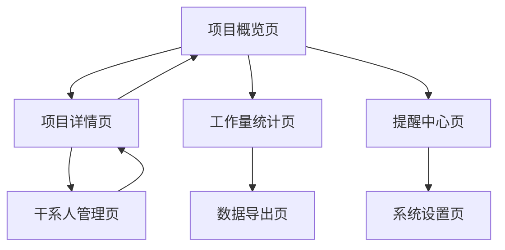

# 个人项目管理系统产品需求文档

## 1. Product Overview
面向个人用户的桌面项目管理系统，专注解决多项目并行管理中的记忆负担和信息跟踪难题。
- 解决用户在管理多个长期项目时无法记住项目变更故事线、工作量统计和重要事项提醒的痛点问题。
- 目标用户为需要同时跟进多个项目的个人工作者，提供直观易用的项目管理和跟踪工具。

## 2. Core Features

### 2.1 User Roles
本系统为单用户桌面应用，无需复杂的用户角色管理。

### 2.2 Feature Module
我们的个人项目管理系统包含以下核心页面：
1. **项目概览页**: 项目卡片展示、快速状态查看、项目搜索筛选
2. **项目详情页**: 项目基本信息、故事线时间轴、任务列表、干系人管理
3. **工作量统计页**: 时间记录、任务完成统计、工作量可视化图表
4. **提醒中心页**: 重要事项提醒、截止日期提醒、通知管理
5. **干系人管理页**: 联系人信息、角色分类、沟通记录
6. **数据导出页**: 报告生成、数据备份、导出设置
7. **系统设置页**: 个人偏好设置、数据管理、系统配置

### 2.3 Page Details
| Page Name | Module Name | Feature description |
|-----------|-------------|---------------------|
| 项目概览页 | 项目卡片展示 | 网格布局显示所有项目，显示项目名称、状态、进度、最后更新时间 |
| 项目概览页 | 快速操作 | 新建项目、项目搜索、状态筛选、排序功能 |
| 项目概览页 | 统计面板 | 显示项目总数、进行中项目、本周任务、待办提醒数量 |
| 项目详情页 | 基本信息 | 项目名称、描述、状态、开始结束日期、优先级设置 |
| 项目详情页 | 故事线时间轴 | 按时间顺序展示项目重要变更、里程碑、决策记录 |
| 项目详情页 | 任务管理 | 任务创建、编辑、状态更新、优先级设置、截止日期 |
| 项目详情页 | 干系人列表 | 显示项目相关人员、角色、联系方式、最后沟通时间 |
| 工作量统计页 | 时间记录 | 手动记录工作时间、任务关联、时间分类统计 |
| 工作量统计页 | 可视化图表 | 日/周/月工作量柱状图、项目时间分布饼图、趋势折线图 |
| 工作量统计页 | 效率分析 | 任务完成率、平均完成时间、工作效率评估 |
| 提醒中心页 | 提醒列表 | 显示所有待处理提醒、已完成提醒、提醒分类筛选 |
| 提醒中心页 | 提醒设置 | 创建自定义提醒、设置提醒时间、重复规则配置 |
| 提醒中心页 | 通知管理 | 桌面通知开关、提醒声音设置、提醒优先级配置 |
| 干系人管理页 | 联系人信息 | 姓名、职位、公司、电话、邮箱、备注信息管理 |
| 干系人管理页 | 沟通记录 | 记录沟通时间、内容、方式、后续行动项 |
| 数据导出页 | 报告生成 | 项目进度报告、工作量报告、自定义时间范围导出 |
| 数据导出页 | 数据备份 | 全量数据备份、增量备份、数据恢复功能 |
| 系统设置页 | 个人偏好 | 界面主题、语言设置、默认视图、快捷键配置 |

## 3. Core Process

**项目管理流程：**
用户打开系统查看项目概览 → 点击项目进入详情页 → 查看项目故事线了解最新进展 → 更新任务状态或添加新的变更记录 → 设置重要事项提醒 → 记录工作时间

**工作量统计流程：**
用户开始工作时启动时间记录 → 选择对应项目和任务 → 工作结束后停止记录 → 系统自动统计并生成可视化图表 → 用户查看工作效率分析

**提醒管理流程：**
用户在项目中设置重要截止日期 → 系统自动创建提醒 → 到达提醒时间时发送桌面通知 → 用户处理提醒事项并标记完成

**页面导航流程图：**

## 4. User Interface Design

### 4.1 Design Style
- **主色调**: 深蓝色(#1E3A8A)、白色(#FFFFFF)、浅灰(#F8FAFC)、中灰(#64748B)
- **点缀色**: 绿色(#10B981)表示完成、橙色(#F59E0B)表示进行中、红色(#EF4444)表示紧急
- **按钮样式**: 圆角矩形按钮，主按钮使用深蓝色，次要按钮使用灰色边框
- **字体**: 标题使用16-20px粗体，正文使用14px常规字重，中文使用微软雅黑
- **布局风格**: 左侧导航栏固定，主内容区域卡片式布局，充分利用桌面空间
- **图标风格**: 使用线性图标，统一风格，清晰易识别

### 4.2 Page Design Overview
| Page Name | Module Name | UI Elements |
|-----------|-------------|-------------|
| 项目概览页 | 项目卡片 | 白色背景卡片，阴影效果，项目状态用彩色标签显示，进度条显示完成度 |
| 项目概览页 | 统计面板 | 顶部横向排列4个统计卡片，数字大字体显示，配备相应图标 |
| 项目详情页 | 故事线时间轴 | 垂直时间轴设计，左侧时间点，右侧内容卡片，重要事件高亮显示 |
| 项目详情页 | 任务列表 | 表格形式展示，支持行内编辑，状态用彩色圆点标识，优先级用星级显示 |
| 工作量统计页 | 图表区域 | 使用Chart.js库，柔和配色，支持交互式图表，数据点悬停显示详情 |
| 提醒中心页 | 提醒卡片 | 按紧急程度分色显示，未读提醒加粗显示，支持批量操作 |
| 干系人管理页 | 联系人卡片 | 头像+信息布局，最近沟通时间显示，快速联系按钮 |

### 4.3 Responsiveness
系统专为PC桌面端设计，支持1366x768及以上分辨率。界面采用弹性布局，适配不同屏幕尺寸。左侧导航栏可收缩以节省空间，主要操作支持键盘快捷键提高效率。