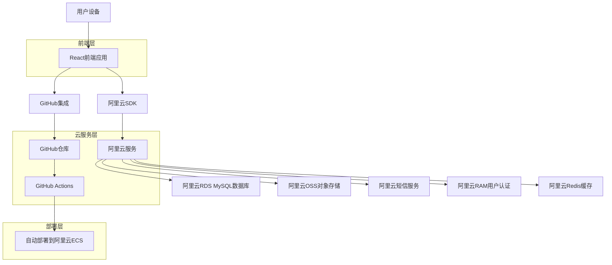
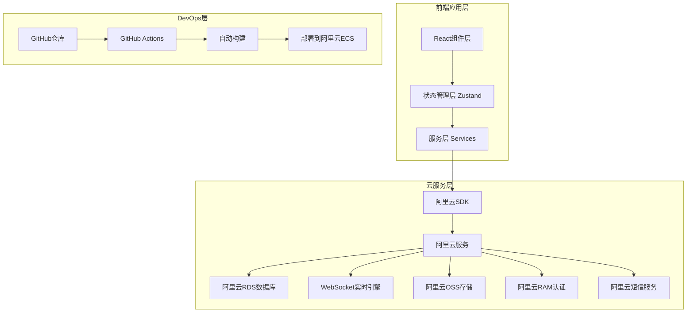
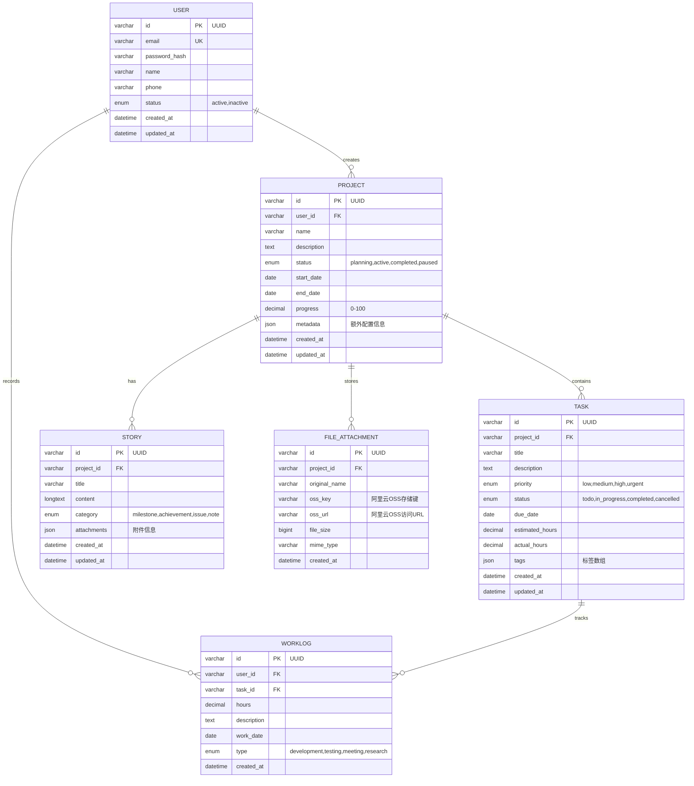

# 个人项目管理系统技术架构文档

## 1. Architecture design



## 2. Technology Description

- Frontend: React@18 + TypeScript + Tailwind CSS@3 + Vite
- State Management: Zustand + 阿里云实时消息服务
- Database: 阿里云RDS MySQL 8.0 (云数据库)
- Cache: 阿里云Redis (缓存服务)
- Authentication: 阿里云RAM + JWT (用户认证授权)
- Real-time: 阿里云消息队列MQ (多设备数据同步)
- File Storage: 阿里云OSS (对象存储服务)
- SMS Service: 阿里云短信服务 (通知提醒)
- Version Control: Git + GitHub (代码版本管理)
- CI/CD: GitHub Actions + 阿里云ECS (自动构建部署)
- Charts: Chart.js + React-Chartjs-2 (数据可视化)
- Icons: Lucide React (统一图标库)
- Date Handling: date-fns (日期处理)
- Notifications: React-Hot-Toast + 阿里云短信服务
- File Export: jsPDF + xlsx (报告导出)
- Build Tool: Vite (快速构建)
- Package Manager: npm
- Deployment: 阿里云ECS + Nginx (云端部署)
- CDN: 阿里云CDN (内容分发网络)

## 3. Route definitions

| Route | Purpose |
|-------|---------|
| / | 项目概览页，显示所有项目卡片和统计信息 |
| /project/:id | 项目详情页，显示具体项目的详细信息和故事线 |
| /workload | 工作量统计页，显示时间记录和可视化图表 |
| /reminders | 提醒中心页，管理所有提醒和通知 |
| /contacts | 干系人管理页，管理项目相关联系人 |
| /export | 数据导出页，生成报告和备份数据 |
| /settings | 系统设置页，个人偏好和系统配置 |

## 4. API definitions (阿里云服务集成)

### 4.1 阿里云服务配置

**环境变量配置 (.env)**
```bash
# 阿里云基础配置
ALIYUN_ACCESS_KEY_ID=your_access_key_id
ALIYUN_ACCESS_KEY_SECRET=your_access_key_secret
ALIYUN_REGION=cn-hangzhou

# 阿里云RDS数据库
ALIYUN_RDS_HOST=your_rds_host
ALIYUN_RDS_PORT=3306
ALIYUN_RDS_DATABASE=project_management
ALIYUN_RDS_USERNAME=your_db_username
ALIYUN_RDS_PASSWORD=your_db_password

# 阿里云OSS对象存储
ALIYUN_OSS_BUCKET=your_bucket_name
ALIYUN_OSS_ENDPOINT=oss-cn-hangzhou.aliyuncs.com

# 阿里云短信服务
ALIYUN_SMS_SIGN_NAME=your_sms_sign
ALIYUN_SMS_TEMPLATE_CODE=SMS_123456789

# 阿里云Redis缓存
ALIYUN_REDIS_HOST=your_redis_host
ALIYUN_REDIS_PORT=6379
ALIYUN_REDIS_PASSWORD=your_redis_password
```

### 4.2 Core API (阿里云服务数据操作)

**项目管理相关**
```typescript
// 项目数据类型
interface Project {
  id: string;
  name: string;
  description: string;
  status: 'planning' | 'active' | 'paused' | 'completed';
  priority: 'low' | 'medium' | 'high';
  startDate: Date;
  endDate?: Date;
  progress: number; // 0-100
  createdAt: Date;
  updatedAt: Date;
}

// 项目操作方法 (使用阿里云RDS)
class ProjectService {
  private rdsClient = new RDSClient({
    accessKeyId: process.env.ALIBABA_ACCESS_KEY_ID,
    accessKeySecret: process.env.ALIBABA_ACCESS_KEY_SECRET,
    endpoint: process.env.ALIBABA_RDS_ENDPOINT
  });
  
  async createProject(project: Omit<Project, 'id' | 'createdAt' | 'updatedAt'>): Promise<Project> {
    const sql = `INSERT INTO projects (name, description, status, priority, start_date, end_date, progress) 
                 VALUES (?, ?, ?, ?, ?, ?, ?) RETURNING *`;
    const result = await this.rdsClient.query(sql, [
      project.name, project.description, project.status, 
      project.priority, project.startDate, project.endDate, project.progress
    ]);
    return result.rows[0];
  }
  
  async updateProject(id: string, updates: Partial<Project>): Promise<Project> {
    const { data, error } = await this.supabase
      .from('projects')
      .update({ ...updates, updated_at: new Date() })
      .eq('id', id)
      .select()
      .single();
    if (error) throw error;
    return data;
  }
  
  async deleteProject(id: string): Promise<void> {
    const { error } = await this.supabase
      .from('projects')
      .delete()
      .eq('id', id);
    if (error) throw error;
  }
  
  async getProject(id: string): Promise<Project | null> {
    const { data, error } = await this.supabase
      .from('projects')
      .select('*')
      .eq('id', id)
      .single();
    if (error) return null;
    return data;
  }
  
  async getAllProjects(): Promise<Project[]> {
    const { data, error } = await this.supabase
      .from('projects')
      .select('*')
      .order('updated_at', { ascending: false });
    if (error) throw error;
    return data || [];
  }
  
  async searchProjects(query: string): Promise<Project[]> {
    const { data, error } = await this.supabase
      .from('projects')
      .select('*')
      .or(`name.ilike.%${query}%,description.ilike.%${query}%`);
    if (error) throw error;
    return data || [];
  }
  
  // 实时订阅项目变更
  subscribeToProjects(callback: (payload: any) => void) {
    return this.supabase
      .channel('projects')
      .on('postgres_changes', {
        event: '*',
        schema: 'public',
        table: 'projects'
      }, callback)
      .subscribe();
  }
}
```

**故事线记录相关**
```typescript
// 故事线事件类型
interface TimelineEvent {
  id: string;
  projectId: string;
  title: string;
  description: string;
  type: 'milestone' | 'decision' | 'change' | 'meeting' | 'issue';
  date: Date;
  importance: 'low' | 'medium' | 'high';
  attachments?: string[];
  createdAt: Date;
}

// 故事线操作方法 (使用Supabase)
class TimelineService {
  private supabase = createClient(supabaseUrl, supabaseKey);
  
  async addEvent(event: Omit<TimelineEvent, 'id' | 'createdAt'>): Promise<TimelineEvent> {
    const { data, error } = await this.supabase
      .from('timeline_events')
      .insert([event])
      .select()
      .single();
    if (error) throw error;
    return data;
  }
  
  async updateEvent(id: string, updates: Partial<TimelineEvent>): Promise<TimelineEvent> {
    const { data, error } = await this.supabase
      .from('timeline_events')
      .update(updates)
      .eq('id', id)
      .select()
      .single();
    if (error) throw error;
    return data;
  }
  
  async deleteEvent(id: string): Promise<void> {
    const { error } = await this.supabase
      .from('timeline_events')
      .delete()
      .eq('id', id);
    if (error) throw error;
  }
  
  async getProjectTimeline(projectId: string): Promise<TimelineEvent[]> {
    const { data, error } = await this.supabase
      .from('timeline_events')
      .select('*')
      .eq('project_id', projectId)
      .order('date', { ascending: false });
    if (error) throw error;
    return data || [];
  }
  
  async getEventsByDateRange(startDate: Date, endDate: Date): Promise<TimelineEvent[]> {
    const { data, error } = await this.supabase
      .from('timeline_events')
      .select('*')
      .gte('date', startDate.toISOString())
      .lte('date', endDate.toISOString())
      .order('date', { ascending: false });
    if (error) throw error;
    return data || [];
  }
}
```

**任务管理相关**
```typescript
// 任务数据类型
interface Task {
  id: string;
  projectId: string;
  title: string;
  description?: string;
  status: 'todo' | 'in-progress' | 'completed';
  priority: 'low' | 'medium' | 'high';
  assignee?: string;
  dueDate?: Date;
  estimatedHours?: number;
  actualHours?: number;
  createdAt: Date;
  completedAt?: Date;
}

// 任务操作方法 (使用Supabase)
class TaskService {
  private supabase = createClient(supabaseUrl, supabaseKey);
  
  async createTask(task: Omit<Task, 'id' | 'createdAt'>): Promise<Task> {
    const { data, error } = await this.supabase
      .from('tasks')
      .insert([task])
      .select()
      .single();
    if (error) throw error;
    return data;
  }
  
  async updateTask(id: string, updates: Partial<Task>): Promise<Task> {
    const { data, error } = await this.supabase
      .from('tasks')
      .update(updates)
      .eq('id', id)
      .select()
      .single();
    if (error) throw error;
    return data;
  }
  
  async deleteTask(id: string): Promise<void> {
    const { error } = await this.supabase
      .from('tasks')
      .delete()
      .eq('id', id);
    if (error) throw error;
  }
  
  async getProjectTasks(projectId: string): Promise<Task[]> {
    const { data, error } = await this.supabase
      .from('tasks')
      .select('*')
      .eq('project_id', projectId)
      .order('created_at', { ascending: false });
    if (error) throw error;
    return data || [];
  }
  
  async getTasksByStatus(status: Task['status']): Promise<Task[]> {
    const { data, error } = await this.supabase
      .from('tasks')
      .select('*')
      .eq('status', status)
      .order('due_date', { ascending: true });
    if (error) throw error;
    return data || [];
  }
}
```

**工作量记录相关**
```typescript
// 工作时间记录类型
interface WorkLog {
  id: string;
  projectId: string;
  taskId?: string;
  description: string;
  startTime: Date;
  endTime: Date;
  duration: number; // 分钟
  date: Date;
  createdAt: Date;
}

// 工作量统计类型
interface WorkloadStats {
  totalHours: number;
  projectBreakdown: { projectId: string; projectName: string; hours: number }[];
  dailyHours: { date: string; hours: number }[];
  weeklyHours: { week: string; hours: number }[];
  monthlyHours: { month: string; hours: number }[];
}

// 工作量操作方法
class WorklogService {
  async startWork(projectId: string, taskId?: string, description?: string): Promise<WorkLog>
  async stopWork(worklogId: string): Promise<WorkLog>
  async addWorkLog(worklog: Omit<WorkLog, 'id' | 'createdAt'>): Promise<WorkLog>
  async getWorkLogs(startDate: Date, endDate: Date): Promise<WorkLog[]>
  async getWorkloadStats(startDate: Date, endDate: Date): Promise<WorkloadStats>
}
```

**提醒系统相关**
```typescript
// 提醒类型
interface Reminder {
  id: string;
  title: string;
  description?: string;
  type: 'deadline' | 'meeting' | 'followup' | 'custom';
  projectId?: string;
  taskId?: string;
  reminderTime: Date;
  isRecurring: boolean;
  recurringPattern?: 'daily' | 'weekly' | 'monthly';
  isCompleted: boolean;
  createdAt: Date;
  completedAt?: Date;
}

// 提醒操作方法
class ReminderService {
  async createReminder(reminder: Omit<Reminder, 'id' | 'createdAt'>): Promise<Reminder>
  async updateReminder(id: string, updates: Partial<Reminder>): Promise<Reminder>
  async deleteReminder(id: string): Promise<void>
  async getActiveReminders(): Promise<Reminder[]>
  async getOverdueReminders(): Promise<Reminder[]>
  async markReminderCompleted(id: string): Promise<Reminder>
}
```

**干系人管理相关**
```typescript
// 联系人类型
interface Contact {
  id: string;
  name: string;
  title?: string;
  company?: string;
  email?: string;
  phone?: string;
  role: string;
  notes?: string;
  projectIds: string[];
  lastContactDate?: Date;
  createdAt: Date;
  updatedAt: Date;
}

// 沟通记录类型
interface CommunicationLog {
  id: string;
  contactId: string;
  projectId?: string;
  type: 'email' | 'phone' | 'meeting' | 'chat';
  subject: string;
  content: string;
  date: Date;
  followUpRequired: boolean;
  followUpDate?: Date;
  createdAt: Date;
}

// 联系人操作方法
class ContactService {
  async createContact(contact: Omit<Contact, 'id' | 'createdAt' | 'updatedAt'>): Promise<Contact>
  async updateContact(id: string, updates: Partial<Contact>): Promise<Contact>
  async deleteContact(id: string): Promise<void>
  async getProjectContacts(projectId: string): Promise<Contact[]>
  async addCommunicationLog(log: Omit<CommunicationLog, 'id' | 'createdAt'>): Promise<CommunicationLog>
  async getContactCommunications(contactId: string): Promise<CommunicationLog[]>
}
```

## 5. Server architecture diagram

基于云端的现代化架构，支持多设备同步和实时协作：



## 6. Data model (阿里云RDS MySQL数据库)

### 6.1 Data model definition



### 6.2 Data Definition Language (阿里云RDS MySQL建表语句)

**完整数据库初始化脚本**

```sql
-- 创建数据库
CREATE DATABASE IF NOT EXISTS project_management 
CHARACTER SET utf8mb4 
COLLATE utf8mb4_unicode_ci;

USE project_management;

-- 用户表 (users)
CREATE TABLE users (
    id VARCHAR(36) PRIMARY KEY DEFAULT (UUID()),
    email VARCHAR(255) UNIQUE NOT NULL,
    password_hash VARCHAR(255) NOT NULL,
    name VARCHAR(100) NOT NULL,
    phone VARCHAR(20),
    status ENUM('active', 'inactive') DEFAULT 'active',
    created_at TIMESTAMP DEFAULT CURRENT_TIMESTAMP,
    updated_at TIMESTAMP DEFAULT CURRENT_TIMESTAMP ON UPDATE CURRENT_TIMESTAMP,
    
    INDEX idx_users_email (email),
    INDEX idx_users_status (status)
) ENGINE=InnoDB DEFAULT CHARSET=utf8mb4 COLLATE=utf8mb4_unicode_ci;

-- 项目表 (projects)
CREATE TABLE projects (
    id VARCHAR(36) PRIMARY KEY DEFAULT (UUID()),
    user_id VARCHAR(36) NOT NULL,
    name VARCHAR(200) NOT NULL,
    description TEXT,
    status ENUM('planning', 'active', 'completed', 'paused') DEFAULT 'planning',
    start_date DATE,
    end_date DATE,
    progress DECIMAL(5,2) DEFAULT 0.00 CHECK (progress >= 0 AND progress <= 100),
    metadata JSON COMMENT '额外配置信息',
    created_at TIMESTAMP DEFAULT CURRENT_TIMESTAMP,
    updated_at TIMESTAMP DEFAULT CURRENT_TIMESTAMP ON UPDATE CURRENT_TIMESTAMP,
    
    INDEX idx_projects_user_id (user_id),
    INDEX idx_projects_status (status),
    INDEX idx_projects_dates (start_date, end_date),
    FOREIGN KEY (user_id) REFERENCES users(id) ON DELETE CASCADE
) ENGINE=InnoDB DEFAULT CHARSET=utf8mb4 COLLATE=utf8mb4_unicode_ci;

-- 任务表 (tasks)
CREATE TABLE tasks (
    id VARCHAR(36) PRIMARY KEY DEFAULT (UUID()),
    project_id VARCHAR(36) NOT NULL,
    title VARCHAR(200) NOT NULL,
    description TEXT,
    priority ENUM('low', 'medium', 'high', 'urgent') DEFAULT 'medium',
    status ENUM('todo', 'in_progress', 'completed', 'cancelled') DEFAULT 'todo',
    due_date DATE,
    estimated_hours DECIMAL(8,2) DEFAULT 0.00,
    actual_hours DECIMAL(8,2) DEFAULT 0.00,
    tags JSON COMMENT '标签数组',
    created_at TIMESTAMP DEFAULT CURRENT_TIMESTAMP,
    updated_at TIMESTAMP DEFAULT CURRENT_TIMESTAMP ON UPDATE CURRENT_TIMESTAMP,
    
    INDEX idx_tasks_project_id (project_id),
    INDEX idx_tasks_status (status),
    INDEX idx_tasks_priority (priority),
    INDEX idx_tasks_due_date (due_date),
    FOREIGN KEY (project_id) REFERENCES projects(id) ON DELETE CASCADE
) ENGINE=InnoDB DEFAULT CHARSET=utf8mb4 COLLATE=utf8mb4_unicode_ci;

-- 故事线表 (stories)
CREATE TABLE stories (
    id VARCHAR(36) PRIMARY KEY DEFAULT (UUID()),
    project_id VARCHAR(36) NOT NULL,
    title VARCHAR(200) NOT NULL,
    content LONGTEXT,
    category ENUM('milestone', 'achievement', 'issue', 'note') DEFAULT 'note',
    attachments JSON COMMENT '附件信息',
    created_at TIMESTAMP DEFAULT CURRENT_TIMESTAMP,
    updated_at TIMESTAMP DEFAULT CURRENT_TIMESTAMP ON UPDATE CURRENT_TIMESTAMP,
    
    INDEX idx_stories_project_id (project_id),
    INDEX idx_stories_category (category),
    INDEX idx_stories_created_at (created_at),
    FOREIGN KEY (project_id) REFERENCES projects(id) ON DELETE CASCADE,
    FULLTEXT INDEX ft_stories_content (title, content)
) ENGINE=InnoDB DEFAULT CHARSET=utf8mb4 COLLATE=utf8mb4_unicode_ci;

-- 工作日志表 (worklogs)
CREATE TABLE worklogs (
    id VARCHAR(36) PRIMARY KEY DEFAULT (UUID()),
    user_id VARCHAR(36) NOT NULL,
    task_id VARCHAR(36) NOT NULL,
    hours DECIMAL(8,2) NOT NULL CHECK (hours > 0),
    description TEXT,
    work_date DATE NOT NULL,
    type ENUM('development', 'testing', 'meeting', 'research') DEFAULT 'development',
    created_at TIMESTAMP DEFAULT CURRENT_TIMESTAMP,
    
    INDEX idx_worklogs_user_id (user_id),
    INDEX idx_worklogs_task_id (task_id),
    INDEX idx_worklogs_work_date (work_date),
    INDEX idx_worklogs_type (type),
    FOREIGN KEY (user_id) REFERENCES users(id) ON DELETE CASCADE,
    FOREIGN KEY (task_id) REFERENCES tasks(id) ON DELETE CASCADE
) ENGINE=InnoDB DEFAULT CHARSET=utf8mb4 COLLATE=utf8mb4_unicode_ci;

-- 文件附件表 (file_attachments)
CREATE TABLE file_attachments (
    id VARCHAR(36) PRIMARY KEY DEFAULT (UUID()),
    project_id VARCHAR(36) NOT NULL,
    original_name VARCHAR(255) NOT NULL,
    oss_key VARCHAR(500) NOT NULL COMMENT '阿里云OSS存储键',
    oss_url VARCHAR(1000) NOT NULL COMMENT '阿里云OSS访问URL',
    file_size BIGINT NOT NULL,
    mime_type VARCHAR(100) NOT NULL,
    created_at TIMESTAMP DEFAULT CURRENT_TIMESTAMP,
    
    INDEX idx_attachments_project_id (project_id),
    INDEX idx_attachments_created_at (created_at),
    FOREIGN KEY (project_id) REFERENCES projects(id) ON DELETE CASCADE
) ENGINE=InnoDB DEFAULT CHARSET=utf8mb4 COLLATE=utf8mb4_unicode_ci;

-- 初始化数据
INSERT INTO users (id, email, password_hash, name, phone) VALUES
('user-001', 'admin@example.com', '$2b$10$example_hash_admin', '系统管理员', '13800138000'),
('user-002', 'demo@example.com', '$2b$10$example_hash_demo', '演示用户', '13900139000');

INSERT INTO projects (id, user_id, name, description, status, start_date, end_date, progress, metadata) VALUES
('proj-001', 'user-001', '个人项目管理系统', '基于React和阿里云的项目管理平台', 'active', '2024-01-01', '2024-06-30', 75.50, '{"priority": "high", "team_size": 1}'),
('proj-002', 'user-001', '移动端UI设计', '响应式设计和用户体验优化', 'planning', '2024-03-01', '2024-05-31', 0.00, '{"priority": "medium", "client": "内部项目"}');

INSERT INTO tasks (id, project_id, title, description, priority, status, due_date, estimated_hours, actual_hours, tags) VALUES
('task-001', 'proj-001', '前端架构设计', '设计React组件架构和状态管理', 'high', 'completed', '2024-01-15', 20.00, 22.50, '["前端", "架构", "React"]'),
('task-002', 'proj-001', '阿里云服务集成', '集成RDS、OSS、短信等阿里云服务', 'high', 'in_progress', '2024-02-01', 30.00, 15.00, '["后端", "阿里云", "集成"]'),
('task-003', 'proj-001', '用户界面开发', '开发项目管理相关页面组件', 'medium', 'todo', '2024-02-15', 25.00, 0.00, '["前端", "UI", "组件"]');

INSERT INTO stories (id, project_id, title, content, category, attachments) VALUES
('story-001', 'proj-001', '项目启动里程碑', '成功完成项目需求分析和技术选型，确定使用React + 阿里云技术栈', 'milestone', '[]'),
('story-002', 'proj-001', '技术架构突破', '成功解决阿里云RDS连接和OSS文件上传的技术难题', 'achievement', '[{"type": "image", "name": "architecture.png"}]');

INSERT INTO worklogs (id, user_id, task_id, hours, description, work_date, type) VALUES
('log-001', 'user-001', 'task-001', 8.00, '完成React项目初始化和基础组件开发', '2024-01-10', 'development'),
('log-002', 'user-001', 'task-001', 6.50, '设计状态管理架构和路由配置', '2024-01-12', 'development'),
('log-003', 'user-001', 'task-002', 4.00, '研究阿里云SDK集成方案', '2024-01-15', 'research');
```

## 7. 阿里云服务配置

### 7.1 阿里云RDS配置
```javascript
// 阿里云RDS连接配置
const rdsConfig = {
  host: process.env.ALIBABA_RDS_HOST,
  port: 3306,
  user: process.env.ALIBABA_RDS_USER,
  password: process.env.ALIBABA_RDS_PASSWORD,
  database: process.env.ALIBABA_RDS_DATABASE,
  connectionLimit: 10,
  acquireTimeout: 60000,
  timeout: 60000
};
```

### 7.2 阿里云OSS配置
```javascript
// 阿里云OSS对象存储配置
const ossConfig = {
  region: process.env.ALIBABA_OSS_REGION,
  accessKeyId: process.env.ALIBABA_ACCESS_KEY_ID,
  accessKeySecret: process.env.ALIBABA_ACCESS_KEY_SECRET,
  bucket: process.env.ALIBABA_OSS_BUCKET
};
```

### 7.3 阿里云短信服务配置
```javascript
// 阿里云短信服务配置
const smsConfig = {
  accessKeyId: process.env.ALIBABA_ACCESS_KEY_ID,
  accessKeySecret: process.env.ALIBABA_ACCESS_KEY_SECRET,
  endpoint: 'https://dysmsapi.aliyuncs.com',
  signName: '项目管理系统',
  templateCode: 'SMS_XXXXXXXX'
};
```

## 8. 部署指导

### 8.1 阿里云ECS部署
1. 创建ECS实例（推荐配置：2核4G，CentOS 7.9）
2. 安装Node.js环境：`curl -fsSL https://rpm.nodesource.com/setup_18.x | sudo bash -`
3. 安装PM2进程管理器：`npm install -g pm2`
4. 配置Nginx反向代理
5. 设置SSL证书（推荐使用阿里云SSL证书服务）

### 8.2 环境变量配置
```bash
# .env.production
ALIBABA_ACCESS_KEY_ID=your_access_key_id
ALIBABA_ACCESS_KEY_SECRET=your_access_key_secret
ALIBABA_RDS_HOST=your_rds_host
ALIBABA_RDS_USER=your_rds_user
ALIBABA_RDS_PASSWORD=your_rds_password
ALIBABA_RDS_DATABASE=project_management
ALIBABA_OSS_REGION=oss-cn-hangzhou
ALIBABA_OSS_BUCKET=your_bucket_name
```

### 8.3 GitHub Actions自动部署配置
```yaml
# .github/workflows/deploy.yml
name: Deploy to Alibaba Cloud ECS
on:
  push:
    branches: [ main ]
jobs:
  deploy:
    runs-on: ubuntu-latest
    steps:
    - uses: actions/checkout@v2
    - name: Setup Node.js
      uses: actions/setup-node@v2
      with:
        node-version: '18'
    - name: Install dependencies
      run: npm ci
    - name: Build
      run: npm run build
    - name: Deploy to ECS
      uses: appleboy/ssh-action@v0.1.5
      with:
        host: ${{ secrets.ECS_HOST }}
        username: ${{ secrets.ECS_USERNAME }}
        key: ${{ secrets.ECS_SSH_KEY }}
        script: |
          cd /var/www/project-management
          git pull origin main
          npm ci
          npm run build
          pm2 restart project-management
```

**任务表 (tasks)**
```sql
-- 创建任务表
CREATE TABLE tasks (
    id UUID PRIMARY KEY DEFAULT gen_random_uuid(),
    project_id UUID REFERENCES projects(id) ON DELETE CASCADE NOT NULL,
    title VARCHAR(200) NOT NULL,
    description TEXT,
    status VARCHAR(20) DEFAULT 'todo' CHECK (status IN ('todo', 'in-progress', 'completed')),
    priority VARCHAR(10) DEFAULT 'medium' CHECK (priority IN ('low', 'medium', 'high')),
    assignee VARCHAR(100),
    due_date DATE,
    estimated_hours DECIMAL(5,2),
    actual_hours DECIMAL(5,2),
    created_at TIMESTAMP WITH TIME ZONE DEFAULT NOW(),
    completed_at TIMESTAMP WITH TIME ZONE
);

-- 创建索引
CREATE INDEX idx_tasks_project_id ON tasks(project_id);
CREATE INDEX idx_tasks_status ON tasks(status);
CREATE INDEX idx_tasks_due_date ON tasks(due_date);

-- 设置RLS
ALTER TABLE tasks ENABLE ROW LEVEL SECURITY;

CREATE POLICY "用户只能访问自己项目的任务" ON tasks
    FOR ALL USING (
        EXISTS (
            SELECT 1 FROM projects 
            WHERE projects.id = tasks.project_id 
            AND projects.user_id = auth.uid()
        )
    );

GRANT ALL ON tasks TO authenticated;
```

**时间线事件表 (timeline_events)**
```sql
-- 创建时间线事件表
CREATE TABLE timeline_events (
    id UUID PRIMARY KEY DEFAULT gen_random_uuid(),
    project_id UUID REFERENCES projects(id) ON DELETE CASCADE NOT NULL,
    title VARCHAR(200) NOT NULL,
    description TEXT,
    type VARCHAR(20) DEFAULT 'milestone' CHECK (type IN ('milestone', 'decision', 'change', 'meeting', 'issue')),
    date DATE NOT NULL,
    importance VARCHAR(10) DEFAULT 'medium' CHECK (importance IN ('low', 'medium', 'high')),
    attachments JSONB DEFAULT '[]',
    created_at TIMESTAMP WITH TIME ZONE DEFAULT NOW()
);

-- 创建索引
CREATE INDEX idx_timeline_events_project_id ON timeline_events(project_id);
CREATE INDEX idx_timeline_events_date ON timeline_events(date DESC);
CREATE INDEX idx_timeline_events_type ON timeline_events(type);

-- 设置RLS
ALTER TABLE timeline_events ENABLE ROW LEVEL SECURITY;

CREATE POLICY "用户只能访问自己项目的时间线" ON timeline_events
    FOR ALL USING (
        EXISTS (
            SELECT 1 FROM projects 
            WHERE projects.id = timeline_events.project_id 
            AND projects.user_id = auth.uid()
        )
    );

GRANT ALL ON timeline_events TO authenticated;
```

**工作日志表 (work_logs)**
```sql
-- 创建工作日志表
CREATE TABLE work_logs (
    id UUID PRIMARY KEY DEFAULT gen_random_uuid(),
    project_id UUID REFERENCES projects(id) ON DELETE CASCADE NOT NULL,
    task_id UUID REFERENCES tasks(id) ON DELETE SET NULL,
    description TEXT,
    start_time TIMESTAMP WITH TIME ZONE NOT NULL,
    end_time TIMESTAMP WITH TIME ZONE,
    duration INTEGER, -- 分钟
    date DATE NOT NULL,
    created_at TIMESTAMP WITH TIME ZONE DEFAULT NOW()
);

-- 创建索引
CREATE INDEX idx_work_logs_project_id ON work_logs(project_id);
CREATE INDEX idx_work_logs_task_id ON work_logs(task_id);
CREATE INDEX idx_work_logs_date ON work_logs(date DESC);

-- 设置RLS
ALTER TABLE work_logs ENABLE ROW LEVEL SECURITY;

CREATE POLICY "用户只能访问自己项目的工作日志" ON work_logs
    FOR ALL USING (
        EXISTS (
            SELECT 1 FROM projects 
            WHERE projects.id = work_logs.project_id 
            AND projects.user_id = auth.uid()
        )
    );

GRANT ALL ON work_logs TO authenticated;
```

**提醒表 (reminders)**
```sql
-- 创建提醒表
CREATE TABLE reminders (
    id UUID PRIMARY KEY DEFAULT gen_random_uuid(),
    user_id UUID REFERENCES auth.users(id) NOT NULL,
    title VARCHAR(200) NOT NULL,
    description TEXT,
    type VARCHAR(20) DEFAULT 'custom' CHECK (type IN ('deadline', 'meeting', 'followup', 'custom')),
    project_id UUID REFERENCES projects(id) ON DELETE CASCADE,
    task_id UUID REFERENCES tasks(id) ON DELETE CASCADE,
    reminder_time TIMESTAMP WITH TIME ZONE NOT NULL,
    is_recurring BOOLEAN DEFAULT false,
    recurring_pattern VARCHAR(20) CHECK (recurring_pattern IN ('daily', 'weekly', 'monthly')),
    is_completed BOOLEAN DEFAULT false,
    created_at TIMESTAMP WITH TIME ZONE DEFAULT NOW(),
    completed_at TIMESTAMP WITH TIME ZONE
);

-- 创建索引
CREATE INDEX idx_reminders_user_id ON reminders(user_id);
CREATE INDEX idx_reminders_reminder_time ON reminders(reminder_time);
CREATE INDEX idx_reminders_is_completed ON reminders(is_completed);

-- 设置RLS
ALTER TABLE reminders ENABLE ROW LEVEL SECURITY;

CREATE POLICY "用户只能访问自己的提醒" ON reminders
    FOR ALL USING (auth.uid() = user_id);

GRANT ALL ON reminders TO authenticated;
```

**联系人表 (contacts)**
```sql
-- 创建联系人表
CREATE TABLE contacts (
    id UUID PRIMARY KEY DEFAULT gen_random_uuid(),
    user_id UUID REFERENCES auth.users(id) NOT NULL,
    name VARCHAR(100) NOT NULL,
    email VARCHAR(255),
    phone VARCHAR(20),
    role VARCHAR(50),
    company VARCHAR(100),
    importance VARCHAR(10) DEFAULT 'medium' CHECK (importance IN ('low', 'medium', 'high')),
    notes TEXT,
    created_at TIMESTAMP WITH TIME ZONE DEFAULT NOW(),
    updated_at TIMESTAMP WITH TIME ZONE DEFAULT NOW()
);

-- 创建索引
CREATE INDEX idx_contacts_user_id ON contacts(user_id);
CREATE INDEX idx_contacts_name ON contacts(name);
CREATE INDEX idx_contacts_importance ON contacts(importance);

-- 设置RLS
ALTER TABLE contacts ENABLE ROW LEVEL SECURITY;

CREATE POLICY "用户只能访问自己的联系人" ON contacts
    FOR ALL USING (auth.uid() = user_id);

GRANT ALL ON contacts TO authenticated;
```

**沟通记录表 (communication_logs)**
```sql
-- 创建沟通记录表
CREATE TABLE communication_logs (
    id UUID PRIMARY KEY DEFAULT gen_random_uuid(),
    contact_id UUID REFERENCES contacts(id) ON DELETE CASCADE NOT NULL,
    project_id UUID REFERENCES projects(id) ON DELETE CASCADE,
    type VARCHAR(20) DEFAULT 'email' CHECK (type IN ('email', 'phone', 'meeting', 'message')),
    subject VARCHAR(200),
    content TEXT,
    date TIMESTAMP WITH TIME ZONE DEFAULT NOW(),
    follow_up_required BOOLEAN DEFAULT false,
    follow_up_date DATE,
    created_at TIMESTAMP WITH TIME ZONE DEFAULT NOW()
);

-- 创建索引
CREATE INDEX idx_communication_logs_contact_id ON communication_logs(contact_id);
CREATE INDEX idx_communication_logs_project_id ON communication_logs(project_id);
CREATE INDEX idx_communication_logs_date ON communication_logs(date DESC);
CREATE INDEX idx_communication_logs_follow_up ON communication_logs(follow_up_required, follow_up_date);

-- 设置RLS
ALTER TABLE communication_logs ENABLE ROW LEVEL SECURITY;

CREATE POLICY "用户只能访问自己的沟通记录" ON communication_logs
    FOR ALL USING (
        EXISTS (
            SELECT 1 FROM contacts 
            WHERE contacts.id = communication_logs.contact_id 
            AND contacts.user_id = auth.uid()
        )
    );

GRANT ALL ON communication_logs TO authenticated;
```

## 7. GitHub集成指导

### 7.1 GitHub账户设置（0代码基础用户指南）

**步骤1：创建GitHub账户**
1. 访问 https://github.com
2. 点击"Sign up"注册账户
3. 填写用户名、邮箱和密码
4. 验证邮箱地址

**步骤2：创建项目仓库**
1. 登录GitHub后，点击右上角"+"号
2. 选择"New repository"
3. 填写仓库名称：`personal-project-management`
4. 选择"Public"或"Private"（推荐Private）
5. 勾选"Add a README file"
6. 点击"Create repository"

**步骤3：获取GitHub Personal Access Token**
1. 点击右上角头像 → Settings
2. 左侧菜单选择"Developer settings"
3. 选择"Personal access tokens" → "Tokens (classic)"
4. 点击"Generate new token (classic)"
5. 设置过期时间和权限（勾选repo、workflow、write:packages）
6. 复制生成的token并妥善保存

### 7.2 本地Git配置

**安装Git（Windows用户）**
1. 下载Git：https://git-scm.com/download/win
2. 运行安装程序，使用默认设置
3. 打开命令提示符或Git Bash

**配置Git用户信息**
```bash
git config --global user.name "你的姓名"
git config --global user.email "你的邮箱@example.com"
```

### 7.3 项目部署到GitHub Pages

**步骤1：项目初始化**
```bash
# 在项目根目录执行
git init
git add .
git commit -m "Initial commit"
git branch -M main
git remote add origin https://github.com/你的用户名/personal-project-management.git
git push -u origin main
```

**步骤2：配置GitHub Actions自动部署**
创建 `.github/workflows/deploy.yml` 文件：
```yaml
name: Deploy to GitHub Pages

on:
  push:
    branches: [ main ]
  pull_request:
    branches: [ main ]

jobs:
  build-and-deploy:
    runs-on: ubuntu-latest
    
    steps:
    - name: Checkout
      uses: actions/checkout@v3
      
    - name: Setup Node.js
      uses: actions/setup-node@v3
      with:
        node-version: '18'
        cache: 'npm'
        
    - name: Install dependencies
      run: npm ci
      
    - name: Build
      run: npm run build
      env:
        VITE_SUPABASE_URL: ${{ secrets.VITE_SUPABASE_URL }}
        VITE_SUPABASE_ANON_KEY: ${{ secrets.VITE_SUPABASE_ANON_KEY }}
        
    - name: Deploy to GitHub Pages
      uses: peaceiris/actions-gh-pages@v3
      with:
        github_token: ${{ secrets.GITHUB_TOKEN }}
        publish_dir: ./dist
```

**步骤3：设置GitHub Secrets**
1. 在GitHub仓库页面，点击"Settings"
2. 左侧选择"Secrets and variables" → "Actions"
3. 点击"New repository secret"
4. 添加以下secrets：
   - `VITE_SUPABASE_URL`：你的Supabase项目URL
   - `VITE_SUPABASE_ANON_KEY`：你的Supabase匿名密钥

**步骤4：启用GitHub Pages**
1. 在仓库Settings中找到"Pages"
2. Source选择"Deploy from a branch"
3. Branch选择"gh-pages"
4. 点击"Save"

## 8. 云存储方案详解

### 8.1 Supabase云数据库配置

**创建Supabase项目**
1. 访问 https://supabase.com
2. 点击"Start your project"
3. 使用GitHub账户登录
4. 点击"New project"
5. 选择组织，填写项目名称和数据库密码
6. 选择地区（推荐Singapore）
7. 等待项目创建完成

**获取项目配置信息**
1. 在项目Dashboard中，点击左侧"Settings"
2. 选择"API"
3. 复制以下信息：
   - Project URL
   - anon public key
   - service_role secret key（谨慎使用）

### 8.2 数据同步机制

**实时数据同步**
```typescript
// 监听项目数据变化
const subscription = supabase
  .channel('projects-changes')
  .on('postgres_changes', 
    { event: '*', schema: 'public', table: 'projects' },
    (payload) => {
      console.log('项目数据变化:', payload)
      // 更新本地状态
      updateLocalProjectState(payload)
    }
  )
  .subscribe()

// 监听任务数据变化
const taskSubscription = supabase
  .channel('tasks-changes')
  .on('postgres_changes',
    { event: '*', schema: 'public', table: 'tasks' },
    (payload) => {
      console.log('任务数据变化:', payload)
      updateLocalTaskState(payload)
    }
  )
  .subscribe()
```

**离线数据缓存**
```typescript
// 使用React Query进行数据缓存
import { useQuery, useMutation, useQueryClient } from '@tanstack/react-query'

// 项目数据查询
const useProjects = () => {
  return useQuery({
    queryKey: ['projects'],
    queryFn: async () => {
      const { data, error } = await supabase
        .from('projects')
        .select('*')
        .order('updated_at', { ascending: false })
      
      if (error) throw error
      return data
    },
    staleTime: 5 * 60 * 1000, // 5分钟缓存
    cacheTime: 10 * 60 * 1000, // 10分钟保留
  })
}
```

### 8.3 多设备访问支持

**响应式设计适配**
- 桌面端：1200px以上，三栏布局
- 平板端：768px-1199px，两栏布局
- 手机端：768px以下，单栏布局

**设备间数据同步**
1. 用户登录后自动同步云端数据
2. 本地操作实时上传到云端
3. 多设备间通过Supabase实时通道同步
4. 冲突解决：以最新时间戳为准

**PWA支持（渐进式Web应用）**
```typescript
// vite.config.ts 配置PWA
import { VitePWA } from 'vite-plugin-pwa'

export default defineConfig({
  plugins: [
    react(),
    VitePWA({
      registerType: 'autoUpdate',
      workbox: {
        globPatterns: ['**/*.{js,css,html,ico,png,svg}']
      },
      manifest: {
        name: '个人项目管理系统',
        short_name: 'ProjectManager',
        description: '高效的个人项目管理工具',
        theme_color: '#ffffff',
        icons: [
          {
            src: 'pwa-192x192.png',
            sizes: '192x192',
            type: 'image/png'
          }
        ]
      }
    })
  ]
})
```

## 9. 完整部署指导（0代码基础）

### 9.1 环境准备

**安装Node.js**
1. 访问 https://nodejs.org
2. 下载LTS版本（推荐18.x或20.x）
3. 运行安装程序，使用默认设置
4. 打开命令提示符，输入 `node --version` 验证安装

**安装代码编辑器**
1. 下载VS Code：https://code.visualstudio.com
2. 安装推荐插件：
   - ES7+ React/Redux/React-Native snippets
   - Prettier - Code formatter
   - GitLens
   - Thunder Client（API测试）

### 9.2 项目初始化步骤

**步骤1：创建项目**
```bash
# 使用Vite创建React项目
npm create vite@latest personal-project-management -- --template react-ts
cd personal-project-management
npm install
```

**步骤2：安装依赖**
```bash
# 安装核心依赖
npm install @supabase/supabase-js
npm install @tanstack/react-query
npm install react-router-dom
npm install @headlessui/react
npm install @heroicons/react
npm install tailwindcss postcss autoprefixer
npm install date-fns
npm install react-hook-form
npm install @hookform/resolvers
npm install zod

# 安装开发依赖
npm install -D @types/node
npm install -D vite-plugin-pwa
```

**步骤3：配置Tailwind CSS**
```bash
npx tailwindcss init -p
```

### 9.3 部署到生产环境

**方式1：GitHub Pages（免费）**
1. 推送代码到GitHub
2. 配置GitHub Actions（见上文）
3. 访问 `https://你的用户名.github.io/personal-project-management`

**方式2：Vercel部署（推荐）**
1. 访问 https://vercel.com
2. 使用GitHub账户登录
3. 点击"New Project"
4. 选择GitHub仓库
5. 配置环境变量（Supabase URL和Key）
6. 点击"Deploy"

**方式3：Netlify部署**
1. 访问 https://netlify.com
2. 拖拽dist文件夹到部署区域
3. 或连接GitHub仓库自动部署

### 9.4 域名配置（可选）

**购买域名**
1. 在阿里云、腾讯云等平台购买域名
2. 配置DNS解析到部署平台
3. 在部署平台添加自定义域名
4. 配置SSL证书（通常自动配置）

**示例DNS配置**
- A记录：@ → 部署平台IP地址
- CNAME记录：www → 部署平台域名

这样，你的个人项目管理系统就完全集成了GitHub版本控制和云存储功能，支持多设备访问和实时数据同步。

1. **手动备份**
   - 在系统设置中点击"导出数据"
   - 保存JSON文件到安全位置

2. **自动备份**
   - 系统会定期将数据保存到浏览器的IndexedDB
   - 可以设置定期导出到本地文件

3. **数据恢复**
   - 在系统设置中选择"导入数据"
   - 选择之前导出的JSON文件
   - 确认恢复操作

### 7.5 常见问题解决
1. **端口被占用**
   - 修改vite.config.ts中的端口配置
   - 或者关闭占用端口的其他程序

2. **依赖安装失败**
   - 尝试删除node_modules文件夹和package-lock.json
   - 重新运行npm install

3. **构建失败**
   - 检查TypeScript类型错误
   - 确保所有导入路径正确

4. **数据丢失**
   - 检查浏览器是否清除了本地数据
   - 从备份文件恢复数据

通过以上详细的技术架构和部署指导，即使是0代码基础的用户也能够成功创建和部署个人项目管理系统。